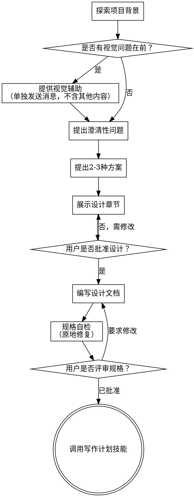

# 头脑风暴：从想法到设计

通过自然的协作对话，帮助将想法转化为完整的设计和规范。

首先了解当前项目背景，然后逐一提问来完善想法。一旦理解了要构建的内容，展示设计并获得用户批准。

<HARD-GATE>
在展示设计并获得用户批准之前，不要调用任何实施技能、编写任何代码、搭建任何项目或采取任何实施行动。这适用于每个项目，无论其看似多么简单。
</HARD-GATE>

## 反模式："这太简单了不需要设计"

每个项目都要经历这个过程。待办清单、单函数工具、配置更改——所有这些。"简单"的项目往往是未经验证的假设导致最多工作浪费的地方。设计可以很简短（对于真正简单的项目只需几句话），但你必须展示它并获得批准。

## 检查清单

你必须为以下每项创建任务并按顺序完成：

1. **探索项目背景** — 检查文件、文档、最近提交
2. **提供视觉伴侣**（如果主题涉及视觉问题）— 这是单独的消息，不与澄清问题合并。参见下文的视觉伴侣部分。
3. **提出澄清问题** — 一次一个问题，理解目的/约束/成功标准
4. **提出2-3种方案** — 包含权衡和你的建议
5. **展示设计** — 按复杂度调整各部分的详细程度，每个部分后获得用户批准
6. **编写设计文档** — 保存到 `docs/zjkycode/specs/YYYY-MM-DD-<topic>-design.md` 并提交
7. **规范自审** — 快速内联检查占位符、矛盾、歧义、范围（见下文）
8. **用户审核书面规范** — 请用户在继续之前审核规范文件
9. **过渡到实施** — 调用 writing-plans 技能创建实施计划

## 流程图

**终止状态是调用 writing-plans。** 不要调用 frontend-design、mcp-builder 或任何其他实施技能。头脑风暴后唯一调用的技能是 writing-plans。

## 流程详解

**理解想法：**

- 首先查看当前项目状态（文件、文档、最近提交）
- 在提出详细问题之前，评估范围：如果请求描述了多个独立子系统（例如，"构建一个包含聊天、文件存储、计费和分析的平台"），立即标记。不要花时间完善一个需要先分解的项目的细节。
- 如果项目太大无法放入单个规范，帮助用户分解为子项目：独立的部分有哪些，它们如何关联，应该按什么顺序构建？然后通过正常的设计流程对第一个子项目进行头脑风暴。每个子项目都有自己的规范 → 计划 → 实施周期。
- 对于范围适当的项目，一次问一个问题来完善想法
- 尽可能使用选择题，但开放式问题也可以
- 每条消息只问一个问题 — 如果一个主题需要更多探索，分成多个问题
- 专注于理解：目的、约束、成功标准

**探索方案：**

- 提出2-3种不同的方案及其权衡
- 以对话方式展示选项，附上你的建议和理由
- 首先展示你推荐的选项并解释原因

**展示设计：**

- 一旦你认为理解了要构建的内容，展示设计
- 根据复杂度调整每个部分的详细程度：简单的话几句话，复杂的话最多200-300字
- 每个部分后询问是否正确
- 涵盖：架构、组件、数据流、错误处理、测试
- 准备好返回澄清如果有不合理的地方

**为隔离和清晰而设计：**

- 将系统分解为更小的单元，每个单元有明确的目的，通过定义良好的接口通信，可以独立理解和测试
- 对于每个单元，你应该能够回答：它做什么，如何使用它，它依赖什么？
- 有人能在不阅读其内部代码的情况下理解一个单元做什么吗？你能在不破坏使用者的情况下更改内部实现吗？如果不能，边界需要改进。
- 更小、边界良好的单元也更容易让你处理 — 你能更好地推理可以一次放入上下文的代码，当文件专注时你的编辑更可靠。当文件变大时，这通常是它做了太多事情的信号。

**在现有代码库中工作：**

- 在提出更改之前探索当前结构。遵循现有模式。
- 如果现有代码存在影响工作的问题（例如，文件变得太大、边界不清、职责纠缠），将针对性改进作为设计的一部分 — 就像优秀的开发者在他们工作的代码中所做的那样。
- 不要提出无关的重构。专注于服务当前目标的内容。

## 设计之后

**文档化：**

- 将验证过的设计（规范）写入 `{项目根目录}/docs/zjkycode/specs/YYYY-MM-DD-<topic>-design.md`
  - （用户对规范位置的偏好会覆盖此默认值）
- 如果可用，使用 elements-of-style:writing-clearly-and-concisely 技能
- 将设计文档提交到 git

**规范自审：**
编写规范文档后，用新的眼光审视它：

1. **占位符扫描：** 有任何 "TBD"、"TODO"、不完整的部分或模糊的需求吗？修复它们。
2. **内部一致性：** 有任何部分相互矛盾吗？架构是否与功能描述匹配？
3. **范围检查：** 这是否足够聚焦于单个实施计划，还是需要分解？
4. **歧义检查：** 任何需求是否可以被两种不同的方式解释？如果是，选择一种并明确说明。

内联修复任何问题。不需要重新审查 — 只需修复并继续。

**用户审核关卡：**
规范审查循环通过后，请用户在继续之前审核书面规范：

> "规范已编写并提交到 `<path>`。请审核它，在开始编写实施计划之前告诉我是否需要进行任何更改。"

等待用户的回复。如果他们请求更改，进行更改并重新运行规范审查循环。只有在用户批准后才继续。

**实施：**

- 调用 writing-plans 技能创建详细的实施计划
- 不要调用任何其他技能。writing-plans 是下一步。

## 核心原则

- **一次一个问题** — 不要用多个问题淹没用户
- **优先选择题** — 尽可能比开放式更容易回答
- **严格遵循 YAGNI** — 从所有设计中删除不必要的功能
- **探索替代方案** — 在确定之前总是提出2-3种方案
- **增量验证** — 展示设计，在继续之前获得批准
- **保持灵活** — 当有不合理的地方返回澄清

## 视觉伙伴
**重要提示**: 详细使用`skill` 加载:
`zjkycode/visual-companion`

基于浏览器的伙伴，用于在头脑风暴期间展示模型、图表和视觉选项。意味着它可用于从视觉处理中受益的问题；这并不意味着每个问题都通过浏览器进行。

**每个问题的决定：** 即使在用户接受后，也要为每个问题决定是使用浏览器还是终端。测试标准：**用户通过看到它比阅读它更能理解吗？**

- **使用浏览器** 用于视觉内容 — 模型、线框图、布局比较、架构图、并排视觉设计
- **直接展示** 用于文本内容 — 需求问题、概念选择、权衡列表、A/B/C/D 文本选项、范围决策

关于 UI 主题的问题不自动是视觉问题。"在这个上下文中个性意味着什么？" 是概念问题 — 使用终端。"哪个向导布局更好？" 是视觉问题 — 使用浏览器。

