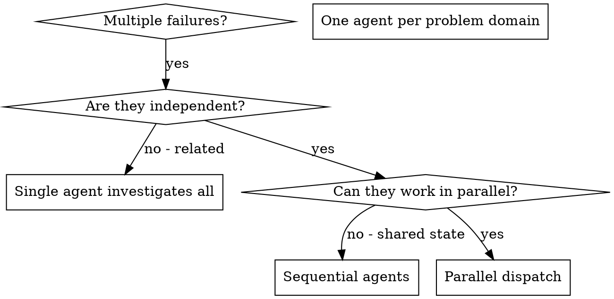

# 派发并行代理

## 概述

你将任务委托给具有隔离上下文的专门代理。通过精确制定他们的指令和上下文，确保他们保持专注并成功完成任务。他们不应该继承你会话的上下文或历史 — 你构建他们确切需要的内容。这也为你自己的协调工作保留了上下文。

当你有多个不相关的失败（不同的测试文件、不同的子系统、不同的 bug）时，按顺序调查会浪费时间。每个调查都是独立的，可以并行进行。

**核心原则：** 每个独立问题域派发一个代理。让他们并发工作。

## 何时使用



**使用场景：**
- 3+ 个测试文件因不同根本原因失败
- 多个子系统独立损坏
- 每个问题可以在没有其他上下文的情况下理解
- 调查之间没有共享状态

**不要使用：**
- 失败是相关的（修复一个可能修复其他）
- 需要理解完整系统状态
- 代理会相互干扰

## 模式

### 1. 识别独立域

按损坏内容分组失败：
- 文件 A 测试：工具审批流程
- 文件 B 测试：批处理完成行为
- 文件 C 测试：中止功能

每个域都是独立的 — 修复工具审批不影响中止测试。

### 2. 创建专注的代理任务

每个代理获得：
- **特定范围：** 一个测试文件或子系统
- **明确目标：** 让这些测试通过
- **约束：** 不要更改其他代码
- **预期输出：** 你发现和修复的内容摘要

### 3. 并行派发

```typescript
// In Claude Code / AI environment
Task("Fix agent-tool-abort.test.ts failures")
Task("Fix batch-completion-behavior.test.ts failures")
Task("Fix tool-approval-race-conditions.test.ts failures")
// All three run concurrently
```

### 4. 审查和整合

当代理返回时：
- 阅读每个摘要
- 验证修复不冲突
- 运行完整测试套件
- 整合所有更改

## 代理提示结构

好的代理提示是：
1. **专注的** - 一个明确的问题域
2. **自包含的** - 理解问题所需的所有上下文
3. **对输出具体** - 代理应该返回什么？

```markdown
Fix the 3 failing tests in src/agents/agent-tool-abort.test.ts:

1. "should abort tool with partial output capture" - expects 'interrupted at' in message
2. "should handle mixed completed and aborted tools" - fast tool aborted instead of completed
3. "should properly track pendingToolCount" - expects 3 results but gets 0

These are timing/race condition issues. Your task:

1. Read the test file and understand what each test verifies
2. Identify root cause - timing issues or actual bugs?
3. Fix by:
   - Replacing arbitrary timeouts with event-based waiting
   - Fixing bugs in abort implementation if found
   - Adjusting test expectations if testing changed behavior

Do NOT just increase timeouts - find the real issue.

Return: Summary of what you found and what you fixed.
```

## 常见错误

**❌ 太宽泛：** "修复所有测试" — 代理会迷失
**✅ 具体：** "修复 agent-tool-abort.test.ts" — 聚焦范围

**❌ 没有上下文：** "修复竞态条件" — 代理不知道在哪里
**✅ 有上下文：** 粘贴错误消息和测试名称

**❌ 没有约束：** 代理可能重构一切
**✅ 有约束：** "不要更改生产代码" 或 "只修复测试"

**❌ 模糊输出：** "修复它" — 你不知道改了什么
**✅ 具体输出：** "返回根本原因和更改的摘要"

## 何时不使用

**相关的失败：** 修复一个可能修复其他 — 先一起调查
**需要完整上下文：** 理解需要查看整个系统
**探索性调试：** 你还不知道什么坏了
**共享状态：** 代理会干扰（编辑相同文件、使用相同资源）

## 会话中的真实示例

**场景：** 大重构后 3 个文件中 6 个测试失败

**失败：**
- agent-tool-abort.test.ts: 3 个失败（时序问题）
- batch-completion-behavior.test.ts: 2 个失败（工具未执行）
- tool-approval-race-conditions.test.ts: 1 个失败（执行计数 = 0）

**决策：** 独立域 — 中止逻辑与批处理完成与竞态条件分开

**派发：**
```
Agent 1 → 修复 agent-tool-abort.test.ts
Agent 2 → 修复 batch-completion-behavior.test.ts
Agent 3 → 修复 tool-approval-race-conditions.test.ts
```

**结果：**
- Agent 1: 用基于事件的等待替换超时
- Agent 2: 修复事件结构 bug（threadId 在错误位置）
- Agent 3: 添加等待异步工具执行完成

**整合：** 所有修复独立，无冲突，完整套件通过

**节省时间：** 3 个问题并行解决 vs 顺序解决

## 核心优势

1. **并行化** - 多个调查同时进行
2. **专注** - 每个代理有狭窄范围，更少上下文跟踪
3. **独立性** - 代理不相互干扰
4. **速度** - 在 1 个问题的时间内解决 3 个问题

## 验证

代理返回后：
1. **审查每个摘要** - 理解改了什么
2. **检查冲突** - 代理是否编辑了相同代码？
3. **运行完整套件** - 验证所有修复一起工作
4. **抽查** - 代理可能犯系统性错误

## 真实世界影响

来自调试会话（2025-10-03）：
- 3 个文件中 6 个失败
- 并行派发 3 个代理
- 所有调查并发完成
- 所有修复成功整合
- 代理更改之间零冲突