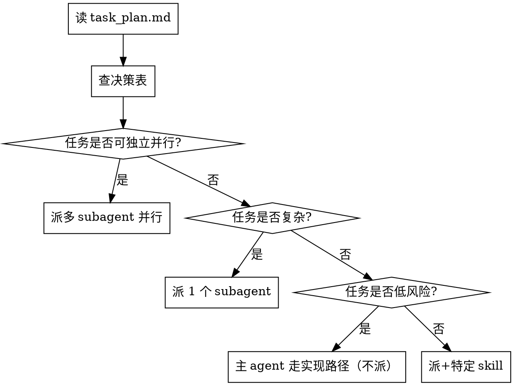

# Decision Matrix (Detailed)

## 4 个维度

### 1. 任务类别（Task Category）
- **新功能（Feature）**：实现新功能、新模块
- **重构（Refactor）**：改进现有代码结构，不改行为
- **调试（Debug）**：定位并修复 bug
- **UI/视觉（UI/Visual）**：涉及 JavaFX UI 或设计
- **集成（Integration）**：跨模块协调
- **写 skill（Skill Writing）**：写新的 skill 文件
- **文档（Documentation）**：写文档、注释
- **研究（Research）**：调研、可行性分析

### 2. 复杂度（Complexity）
- **低**：1-2 文件，单一职责
- **中**：3-5 文件，涉及 1-2 个模块
- **高**：>5 文件，跨多个模块

### 3. 独立性（Independence）
- **高**：与其他任务无共享状态，可独立完成
- **中**：与少量任务共享接口（通过 plan/contracts/）
- **低**：强依赖其他任务（必须串行）

### 4. 风险（Risk）
- **低**：失败影响小（测试文件、文档）
- **中**：失败影响 1-2 个模块
- **高**：失败影响核心功能、数据丢失

## 决策规则矩阵

| 类别 | 复杂度 | 独立性 | 风险 | 决策 | 调用 skill |
|---|---|---|---|---|---|
| 任意 | 低 | 高 | 低 | **不派** | 主 agent 走实现路径 |
| 任意 | 中 | 中 | 中 | **派 1 个** | subagent-driven-development |
| 任意 | 高 | 高 | 中 | **派 1 个** | subagent-driven-development |
| 任意 | 高 | 低 | 中 | **派 1 个串行** | subagent-driven-development |
| 任意 | 中-高 | 高 | 中 | **派多并行** | dispatching-parallel-agents |
| UI/视觉 | 任意 | 中 | 中 | **派 + visual-companion** | visual-companion + subagent-driven |
| 调试 | 任意 | 中 | 高 | **派 systematic-debugging** | systematic-debugging |
| 写 skill | 任意 | 高 | 低 | **派 writing-skills** | writing-skills |
| 重构 | 中-高 | 中 | 中 | **派 + TDD** | subagent-driven + TDD |
| 集成多模块 | 高 | 中 | 高 | **派 + 实施后 review** | subagent-driven + code review |

## 决策流程图

## 决策反合理化

| 借口 | 反驳 |
|---|---|
| "决策表没覆盖这个任务" | **未覆盖 = 不派 + 咨询用户**。**不要硬派**。 |
| "复杂度我列错了" | 重新读 task_plan.md 评估。**不要硬派**。 |
| "派太多次更费 token" | 派比上下文污染便宜。**当决策表说派时就派**。 |
| "我自己干更快" | 临时效率 < 流程纪律。**主 agent 永远不走实现路径**除非决策表说"不派"。 |
