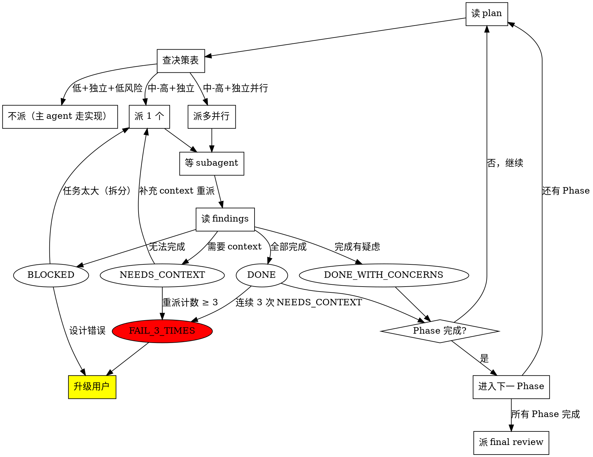

# Main Loop Pseudocode

这是主 agent 严格遵循的循环。不是真的代码——是给 LLM 读的"剧本"。

## 完整伪代码

```
WHILE task_plan.md 还有未完成 Phase:
    # ====== 协调路径 - 主 agent 亲自干 ======
    
    读 task_plan.md，识别当前 Phase + 下一个待办
    
    查 4 维决策表（references/decision-matrix.md）:
        IF 任务低复杂 + 高独立 + 低风险:
            决策 = 不派。主 agent 走实现路径
            （仍按 subagent-prompt 模板记录到 progress/）
        ELIF 任务可独立并行:
            决策 = 派多并行
            派多个 subagent（按 dispatching-parallel-agents）
        ELSE:
            决策 = 派 1 个
            派一个 subagent（按 subagent-driven-development）
    
    # ====== 派 subagent 流程 ======
    
    派 subagent 时:
        a. 准备 context packet：
           - 读 plan/contracts/ 找相关契约
           - 读 findings/ 找相关子代理的输出
           - 用 references/context-packet-template.md 格式
        b. 派 subagent（Agent 工具 或 cli_agent 工具）
        c. 等 subagent 完成
        d. 读 findings/<task-id>.md
    
    # ====== 处理 subagent 返回 ======
    
    IF subagent 状态:
        DONE:
            进入下一任务，更新 task_plan.md
        DONE_WITH_CONCERNS:
            阅读疑虑，决定：
                - 是观察 → 记录到 decisions.md
                - 是问题 → 处理（重派/修改/升级用户）
        NEEDS_CONTEXT:
            补充 context，重派（计数 +1，max 3 次）
        BLOCKED:
            分析原因：
                - 上下文问题：补充后重派
                - 任务太大：拆分，分别派
                - 设计错误：升级到用户
        FAIL_3_TIMES:
            升级到用户（3-Strike Protocol）
    
    # ====== 推进 Phase ======
    
    检查 task_plan.md 阶段状态
    IF 当前 Phase 全部完成:
        进入下一 Phase
    ELIF Phase 内所有子任务完成:
        标记 Phase complete
        进入下一 Phase
END WHILE

# ====== 收尾 ======

收尾:
    派 final code review subagent（requesting-code-review）
    派 verification-before-completion subagent
    更新 plan/decisions.md 记录所有关键决策
    更新 docs/CHANGELOG.md
    更新 pom.xml 版本（如果适用）
    调用 finishing-a-development-branch
```

## 状态机图



## 关键不变量（Invariants）

1. **决策表覆盖完整性**：未覆盖 = 不派 + 升级用户
2. **失败计数**：NEEDS_CONTEXT 重派最多 3 次
3. **状态文件化**：每次状态变化都写 plan/task_plan.md
4. **决策可审计**：所有"为什么这么决定"都写 plan/decisions.md

## 与现有 subagent-driven-development 的关系

本 skill 是**高层编排器**，`subagent-driven-development` 是**具体执行器**。

调用流程：
- 本 skill 的 4 步循环 → 决定派 → 调用 subagent-driven-development → 派 subagent
- 本 skill 的多任务派发 → 调用 dispatching-parallel-agents
