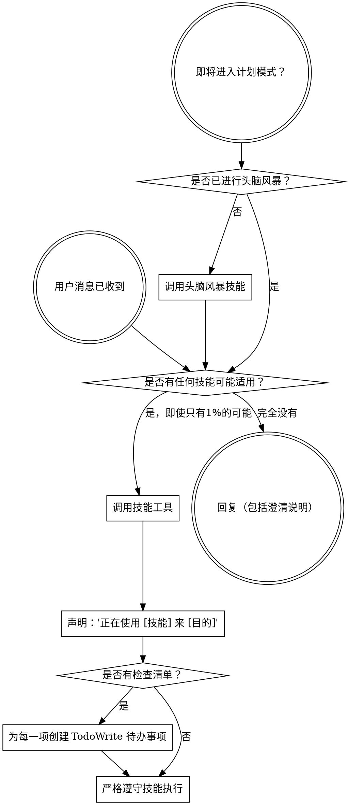

<SUBAGENT-STOP>
If you were dispatched as a subagent to execute a specific task, skip this skill.
</SUBAGENT-STOP>

<EXTREMELY-IMPORTANT>
If you think there is even a 1% chance a skill might apply to what you are doing, you ABSOLUTELY MUST invoke the skill.

IF A SKILL APPLIES TO YOUR TASK, YOU DO NOT HAVE A CHOICE. YOU MUST USE IT.

This is not negotiable. This is not optional. You cannot rationalize your way out of this.
</EXTREMELY-IMPORTANT>

## 指令优先级

zjkycode skills 覆盖默认系统提示行为，但**用户指令始终优先**：

1. **用户明确指令**（CLAUDE.md、GEMINI.md、AGENTS.md、CODE_AGENT.md、直接请求）— 最高优先级
2. **zjkycode skills** — 在冲突处覆盖默认系统行为
3. **默认系统提示** — 最低优先级

如果 CLAUDE.md、GEMINI.md 、CODE_AGENT.md 或 AGENTS.md 说"不要使用 TDD"，而某个 skill 说"始终使用 TDD"，请遵循用户指令。用户拥有控制权。

## 如何访问 Skills

**在 Claude Code 中：** 使用 `Skill` 工具。当你调用 skill 时，其内容会被加载并呈现给你 — 直接遵循它。永远不要使用 Read 工具读取 skill 文件。

**在 javaclawbot 中：** 使用 `Skill` 工具。当你调用 skill 时，其内容会被加载并呈现给你 — 直接遵循它。永远不要使用 Read 工具读取 skill 文件。

# 使用 Skills

## 规则

**在任何响应或操作之前调用相关或请求的 skills。** 即使只有 1% 的可能性某个 skill 适用，你也应该调用该 skill 进行检查。如果调用的 skill 最终不适用于当前情况，你不需要使用它。



## 危险信号

这些想法意味着停止 — 你在找借口：

| 想法 | 现实 |
|------|------|
| "这只是个简单的问题" | 问题也是任务。检查 skills。 |
| "我需要先了解更多上下文" | Skill 检查在澄清问题之前进行。 |
| "让我先探索代码库" | Skills 告诉你如何探索。先检查。 |
| "我可以快速检查 git/文件" | 文件缺少对话上下文。检查 skills。 |
| "让我先收集信息" | Skills 告诉你如何收集信息。 |
| "这不需要正式的 skill" | 如果存在 skill，就使用它。 |
| "我记得这个 skill" | Skills 会演变。阅读当前版本。 |
| "这不算是一个任务" | 行动 = 任务。检查 skills。 |
| "这个 skill 太过了" | 简单的事情会变复杂。使用它。 |
| "我就先做这一件事" | 在做任何事之前检查。 |
| "这感觉很高效" | 无纪律的行动浪费时间。Skills 防止这种情况。 |
| "我知道那是什么意思" | 了解概念 ≠ 使用 skill。调用它。 |

## Skill 优先级

当多个 skills 可能适用时，使用此顺序：

1. **流程 skills 优先**（brainstorming、debugging）— 这些决定如何处理任务
2. **实现 skills 其次**（frontend-design、mcp-builder）— 这些指导执行

"让我们构建 X" → 先 brainstorming，然后实现 skills。
"修复这个 bug" → 先 debugging，然后领域特定 skills。

## Skill 类型

**严格的**（TDD、debugging）：精确遵循。不要偏离规范。

**灵活的**（patterns）：根据上下文调整原则。

Skill 本身会告诉你属于哪种类型。

## 用户指令

指令说的是做什么，而不是怎么做。"添加 X" 或 "修复 Y" 不意味着跳过工作流程。

<强制工作流>

## 任务分类与工作流

根据任务类型，**必须严格遵循对应的工作流程**：

| 任务类型 | 触发词示例 | 必须工作流 |
|---------|-----------|-----------|
| **构建类** | 创建、添加、构建、实现、开发、编写 | brainstorming → writing-plans → 执行 → code-review → verification → finishing |
| **调试类** | 修复、调试、解决、报错、bug、错误 | systematic-debugging → TDD → code-review → verification |
| **重构类** | 重构、优化、改进、改善 | brainstorming → writing-plans → 执行 → code-review → verification |
| **分析类** | 解释、分析、说明、为什么、怎么工作 | 无需工作流，直接回答 |

## 构建类任务完整工作流

对于任何"创建/构建/添加/实现/开发"类任务，**必须严格按以下顺序执行**：

```
步骤 1: brainstorming（头脑风暴）
        │
        ├─ 理解需求和约束
        ├─ 探索方案（2-3种）
        ├─ 展示设计获得用户批准
        └─ 输出：设计文档
        │
        ▼
步骤 2: writing-plans（编写计划）
        │
        ├─ 创建详细实施计划
        ├─ 定义文件结构、任务分解
        └─ 输出：实施计划文档
        │
        ▼
步骤 3: 执行
        │
        ├─ subagent-driven-development（推荐）
        │   每个任务派发子代理 + 两阶段审查
        │
        └─ executing-plans（备选）
            批量执行 + 检查点审查
        │
        ▼
步骤 4: code-review（代码审查）
        │
        ├─ 每个功能/任务完成后自动触发
        └─ 用户明确要求时触发
        │
        ▼
步骤 5: verification-before-completion（完成前验证）
        │
        ├─ 运行测试命令，验证通过
        ├─ 检查需求清单，确认完成
        └─ **没有验证证据不得声称完成**
        │
        ▼
步骤 6: finishing-a-development-branch（完成分支）
        │
        └─ 合并/PR/清理工作树
```

**每个步骤的输出是下一个步骤的输入，未经豁免不得跳过。**

## 调试类任务工作流

```
步骤 1: systematic-debugging（系统化调试）
        │
        ├─ 阶段1: 根本原因调查（阅读错误、复现、收集证据）
        ├─ 阶段2: 模式分析（找工作示例、对比差异）
        ├─ 阶段3: 假设和测试（最小化测试、验证）
        └─ 阶段4: 实现（创建失败测试、修复、验证）
        │
        ▼
步骤 2: test-driven-development（TDD）
        │
        └─ 编写测试验证修复
        │
        ▼
步骤 3: code-review（代码审查）
        │
        ▼
步骤 4: verification-before-completion（完成前验证）
        │
        └─ 验证 bug 已修复，无回归
```

**铁律：没有根本原因调查就不能提出修复方案。**

## UI/前端任务特殊要求

涉及以下内容时，**必须使用 visual-companion（视觉伴侣）技能**：

- UI 界面设计
- 前端布局
- 图标设计
- 视觉原型
- 交互设计

```
UI类任务工作流：

brainstorming
    │
    ├─ 提供视觉伴侣（单独消息）
    │   "我们正在处理的内容，如果可以在浏览器中展示会更易于理解..."
    │
    ├─ 使用浏览器展示模型、线框图、布局比较
    │
    └─ 继续正常工作流 → writing-plans → ...
```

## 强制技能与可选技能

### 强制技能（必须调用）

| 技能 | 触发条件 | 不可跳过原因 |
|------|---------|-------------|
| **brainstorming** | 构建类/重构类任务 | 理解需求是实施基础 |
| **writing-plans** | brainstorming 完成后 | 计划指导有序执行 |
| **systematic-debugging** | 调试类任务 | 防止随机修复制造新 bug |
| **verification-before-completion** | 声称完成之前 | 防止虚假完成 |
| **visual-companion** | UI/前端/图标任务 | 视觉内容需要视觉验证 |

### 可选技能（按需调用）

| 技能 | 使用场景 |
|------|---------|
| **requesting-code-review** | 复杂功能完成后、合并前 |
| **test-driven-development** | 需要测试保障的功能 |
| **using-git-worktrees** | 需要隔离工作区 |
| **dispatching-parallel-agents** | 多个独立任务可并行 |

## 用户豁免条件

只有当用户**明确表达**以下意思时，可以跳过 brainstorming + writing-plans：

- "直接做，不需要计划"
- "跳过计划"
- "不用写计划了"
- "简单做就行，不需要头脑风暴"
- "我已经想好了，直接实现"

**注意**：
- 用户说"简单"或"快速"不等于豁免
- 用户说"这个功能很简单"不等于豁免
- 只有明确的"跳过计划/不需要计划"指令才有效

**豁免后仍需执行**：
- verification-before-completion（完成前验证）
- code-review（代码审查，除非用户也明确跳过）

## 代码审查触发条件

**必须触发代码审查**：
1. 每个功能/任务完成后
2. 合并到主分支前
3. 用户明确要求时

**代码审查流程**：
1. 获取 git SHA（base 和 head）
2. 派发 code-reviewer 子代理
3. 根据反馈修复问题
4. 验证修复有效

## 危险信号（停止并检查）

| 想法 | 正确行为 |
|------|---------|
| "这很简单，不需要计划" | 简单也需要完整流程 |
| "用户说快速添加，跳过流程" | "快速"不等于豁免 |
| "我先开始写代码" | 必须先 brainstorming → writing-plans |
| "测试应该能通过" | 运行测试命令验证 |
| "看起来修复了" | 验证根本原因已解决 |
| "这个 bug 很明显" | 仍需 systematic-debugging 流程 |
| "不需要审查这个" | 每个功能完成后必须审查 |

**非常重要: 严格按照技能指导走!**
</强制工作流>